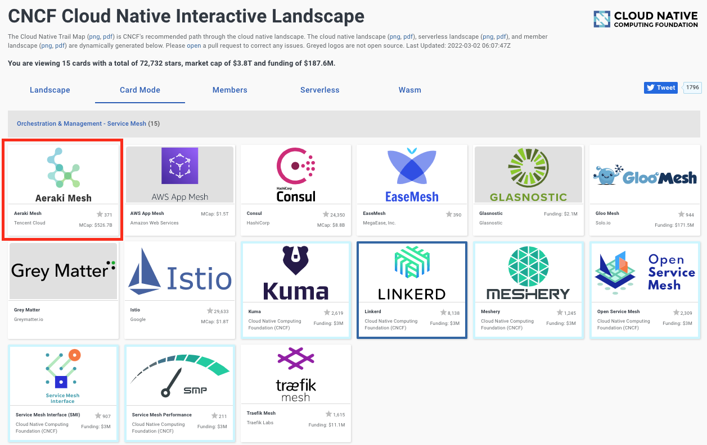

近日，Aeraki Mesh 正式进入 CNCF 云原生全景图，位于 [Service Mesh](https://landscape.cncf.io/card-mode?category=service-mesh&grouping=category) 类别下。CNCF Landscape 在云原生实践过程中的每个环节帮助用户了解有哪些具体的软件和产品选择，Aeraki Mesh 进入 CNCF Landscape，意味着 Aeraki Mesh 正式成为了 CNCF 认可的构建云原生最佳实践中的一环。

## 什么是 CNCF 云原生全景图？

Cloud Native Computing Foundation，云原生计算基金会（以下简称CNCF）是一个开源软件基金会，它致力于云原生（Cloud Native）技术的普及和可持续发展。云原生技术通过一系列的软件、规范和标准帮助企业和组织，在现代的动态环境（如公共云、私有云和混合云）中构建和运行敏捷的、可扩展的应用程序。

CNCF 发布了云原生全景图（CNCF Landscape），旨在帮助企业和开发人员快速了解云原生体系的全貌，帮助用户选择云原生实践中的恰当的软件和工具，因此受到广大开发者和使用者的关注和重视。

## Aeraki Mesh 解决了云原生中的什么问题？

Aeraki Mesh 是 Service Mesh 领域的一个开源项目，解决目前的服务网格项目只处理 了 HTTP/gRPC 协议，不支持其他开源及私有协议的痛点。

Aeraki Mesh 可以帮助你在服务网格中管理任何七层协议。目前已经支持了 Dubbo、Thrit、Redis、Kafka、ZooKeeper 等开源协议。你还可以使用 Aeraki Mesh 提供的 MetaProtocol 协议扩展框架来管理私有协议的七层流量。

目前 Aeraki 已经在央视频、腾讯音乐、王者破晓等多个大型项目中得到了应用，并经过了 2022 冬奥会线上大规模流量的实际检验。Aeraki 的主要特点：
* 和 Istio 无缝集成，是 [Istio Ecosystem](https://istio.io/latest/about/ecosystem/) 集成推荐项目。
* 支持在 Istio 中管理 Dubbo、Thrift、Redis 等开源协议的流量。
* 支持在 Istio 中管理私有协议的流量，只需数百行代码，对 Istio 无任何改动。
* 支持请求级负载均衡，支持任意匹配条件的动态路由，全局和本地限流，流量镜像等流量管理能力。
* 提供丰富的请求级性能指标，包括请求时延、错误、数量等，支持分布式调用跟踪。

## 我想使用 Aeraki Mesh / 加入社区贡献？

Aeraki Mesh 是一个厂商中立的开源社区，目前社区正在大力发展中，欢迎大家加入！

安装试用：https://www.aeraki.net/zh/docs/v1.0/quickstart/

加入社区会议：https://www.aeraki.net/zh/community/#community-meetings

Star 一下: https://github.com/aeraki-mesh/aeraki

